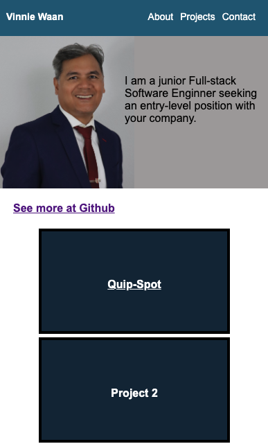

# Sample Portfolio
 
## Table of Contents

- [Description](#description)
- [Usage](#usage)
- [Credits](#credits)
- [Badges](#badges)

## Description

Assignment: Advanced CSS: Portfolio 

Task:
- Create a portfolio application with no starter code
- Create developer's name, a recent photo or avatar, and links to sections about them, their work, and how to contact them.
- Create links to previous project and sections on the page.
- Create application image. Image should be larger in size than the others.
- Create a responsive layout.

Lessons Learned:
- Better understanding of responsiveness and flex-boxes
- Added photo and resized
- Added links to Github, previous project, and sections on the page.
- Used the git commands to save and push to remote repo
- Deployed the application (See Usage)
- Commented on html and CSS files

## Usage

Launch live site at [https://vinniewaan.github.io/code-refractor-main/](https://vinniewaan.github.io/code-refractor-main/) 

## Credits

[Vinnie Waan](https://github.com/VinnieWaan/)

## Badges

